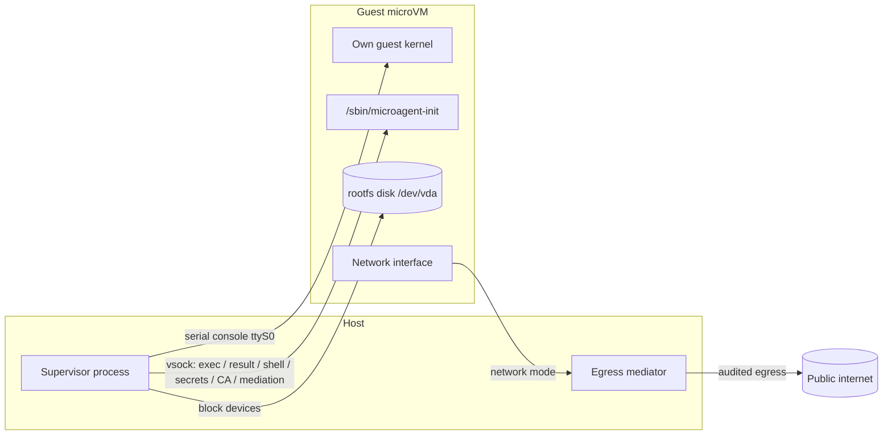

<!-- docs-last-updated -->
_Last updated: 2026-07-30_

microagent's core claim is simple: every workspace is a real Linux VM, not a
shared kernel with namespaces drawn around it. Each workspace boots its own
kernel against its own disk, behind a boundary the host controls. This page
shows what that boundary contains, how a workspace crosses from an OCI image to
a running guest, and how the code that does it is layered.

## The VM boundary

A workspace is a microVM. The host runs a supervisor process; the guest runs a
Linux kernel and your image's userspace. Nothing crosses between them except
over channels the host wires explicitly.



### What exists per workspace

- **Its own guest kernel.** The supervisor boots a guest kernel for this VM;
  the kernel command line pins `root=/dev/vda rw init=/sbin/microagent-init`
  (`pkg/supervisors/firecracker/supervisor_linux.go`).
- **Its own rootfs disk.** An ext4 image built from the OCI image, attached as
  the guest's root block device. See [Storage](/concepts/storage/#the-rootfs).
- **Its own network interface and namespace.** Each workspace declares one
  [network mode](/concepts/networking/); in the default `user` mode the
  host-side egress mediator does its work scoped inside that workspace's own
  user namespace.
- **vsock channels.** Guest-to-host sockets for structured exec, results, the
  console/connect shell, secret delivery, CA-certificate delivery, and the
  [mediation channel](/concepts/networking/#mediation-channel).
- **A serial console.** `console=ttyS0`, carrying the log stream and the
  optional console shell.

### What crosses the boundary

- **vsock**, for everything structured: [exec](/cli/exec/) requests and
  responses, the [result](/cli/result/) file, the [connect](/cli/connect/)
  shell, [secret delivery](/guides/secrets/), the per-workspace CA certificate,
  and [mediation-channel](/guides/agents-and-mediation/) calls into your host
  control plane. Guest init serves each on a declared port.
- **The serial console**, for [logs](/cli/logs/) and interactive console
  access.
- **Block devices**, for the rootfs and any [attached
  storage](/concepts/storage/#attaching-extra-storage) or [named
  volume](/concepts/storage/#named-volumes).
- **Network traffic**, via the chosen network mode — and, under the default
  `user` mode, through the host [egress mediator](/concepts/egress-mediation/)
  that decides, forwards, and records each connection.

Everything else stays on its own side. Host details live behind the supervisor
boundary (see [Boundaries](/concepts/boundaries/)); the guest sees only the
devices and sockets the supervisor gave it.

## How a workspace boots

The path from an image reference to a ready guest is the same set of steps on
every supported host; where a step is backend-specific, it stays behind the
supervisor boundary.

1. **OCI image to rootfs.** `pkg/rootfs` resolves the image reference (a
   local committed-OCI layout first, then the remote registry) and fetches
   the manifest and config. It validates the config's OS/architecture
   against the target platform, then extracts each layer into a stage
   directory, applying whiteouts as it goes. It then injects the guest init
   binary and builds the ext4 image with `mke2fs -d`
   (`pkg/rootfs/builder.go`). Nothing per-workspace goes into the image: the
   command, env, mounts, forwards, console shell, and declared files all
   travel on a per-boot config disk, so every rootfs built from the same OCI
   image is byte-identical.
2. **Verification hashes.** A named workspace persists a verification record
   when the rootfs is built or copied: the OCI reference, resolved reference,
   and digest, plus the SHA-256 of the kernel, the rootfs, the injected
   guest init, and the per-boot config disk. The build uses a content-addressed
   per-workspace copy of guest init instead of a package-manager installation
   path. `status` recomputes and compares these — see [Runtime
   verification](/concepts/state-and-identity/#runtime-verification).
3. **Kernel selection and verification.** `pkg/kernel` resolves the kernel from
   a cryptographically signed, TUF-verified manifest. If no kernel is installed
   and the caller did not choose one, the workspace installs a verified default
   kernel to the per-user path (`pkg/workspace/kernel.go`); an explicit path is
   used as-is. See [`microagent kernel`](/cli/kernel/).
4. **Supervisor launch.** microagent selects the host backend from the
   request's `backend` identity and hands the built rootfs, kernel, and VM
   configuration to that supervisor. On Linux this is the Firecracker
   supervisor (`pkg/supervisors/firecracker`); on macOS it is the Apple
   Virtualization.framework supervisor (`supervisors/applevf`). The difference
   stays behind the supervisor boundary.
5. **Guest-init handoff.** The kernel boots with `init=/sbin/microagent-init`
   and `microagent_config=/dev/vdX` naming the config disk — a read-only
   block device the host regenerates for every boot, carrying the run
   config and declared files as a raw tar stream. Guest init then
   (`cmd/microagent-guestinit/main.go`):
   - mounts `/proc`, `/sys`, and `/dev`
   - reads the config from that device and materializes declared files
   - applies env and hostname
   - runs the setup command or the workspace command the host chose for
     this boot
   - serves the vsock listeners

   Because the host hands each boot its own config, a restart always runs
   what the workspace manifest currently declares. A failed setup boot
   retries setup; a completed one boots the final command.
6. **Readiness signals.** As the guest comes up, `status` reports the five
   readiness signals — `guestReady`, `shellReady`, `execReady`, `resultReady`,
   and `mediationReady` — so callers can sequence work without polling files or
   serial logs. See [Readiness](/concepts/state-and-identity/#readiness).

## Where the credential swap happens

The credential-protection mechanism lives on the host side of the boundary, by
design. For an allowlisted, intercepted host (interception requires
`--egress mitm`), the [egress
mediator](/concepts/egress-mediation/#credential-swap) injects a real
credential into the guest's outbound request before forwarding it upstream. The
agent sends an unauthenticated or placeholder request; the secret is resolved
and attached on the host and never enters the guest's filesystem or memory. The
guest never holds the credential it is using.

This is mechanism, not credential governance. microagent resolves and
substitutes the reference declared by the operator; it does not decide whether
an identity is entitled to that credential, mint a grant, or interpret the
resulting audit record. Those decisions belong to the calling control plane.

## Lifecycle

A workspace moves through a defined set of states — `prepared`, `running`,
`paused`, `halted`, `quarantined`, and the rest — each reported as a JSON
event. Rather than repeat the transitions here, see the state diagram and the
readiness and event contract in [State and
identity](/concepts/state-and-identity/).

## How the code is layered

All three entry points call the same Go packages. The CLI and MCP server are
adapters, not separate runtimes.

```text
shell, MCP client, or Go program
  └─ microagent packages
       ├─ pkg/workspace ─ workspace lifecycle and exec
       ├─ pkg/rootfs · pkg/kernel · pkg/imagecache · pkg/diagnostics
       └─ pkg/vmkit ─ supervisor dispatch
            └─ host supervisor
```

- Use the **CLI** when a human or shell script is running workspaces. Start
  with [`microagent run`](/cli/run/) for one-shot work; use
  [`create`](/cli/create/), [`start`](/cli/start/), [`exec`](/cli/exec/), and
  [`delete`](/cli/delete/) for named workspaces.
- Use **MCP** ([`microagent serve mcp`](/cli/serve/)) when a coding tool or
  agent client needs structured workspace tools over stdio.
- Use the **[Go library](/library/)** when workspace lifecycle is part of your
  program and you want typed options, typed results, and direct error handling.

`pkg/workspace` owns workspace lifecycle, state, disks, identity, exec,
results, and artifacts. `pkg/rootfs` turns OCI images into bootable ext4 disks.
`pkg/kernel` installs and verifies default kernels. `pkg/imagecache` manages
reusable local rootfs baselines. `pkg/diagnostics` powers `microagent doctor`.
`pkg/vmkit` holds the request and response types and dispatches to the host
supervisor.

[Run one-shot commands](/guides/one-shot-runs/) shows this flow from the
operator's side; Go callers can drive the same package flow directly — see the
[library overview](/library/) and the [Go library reference](/library/go/).
