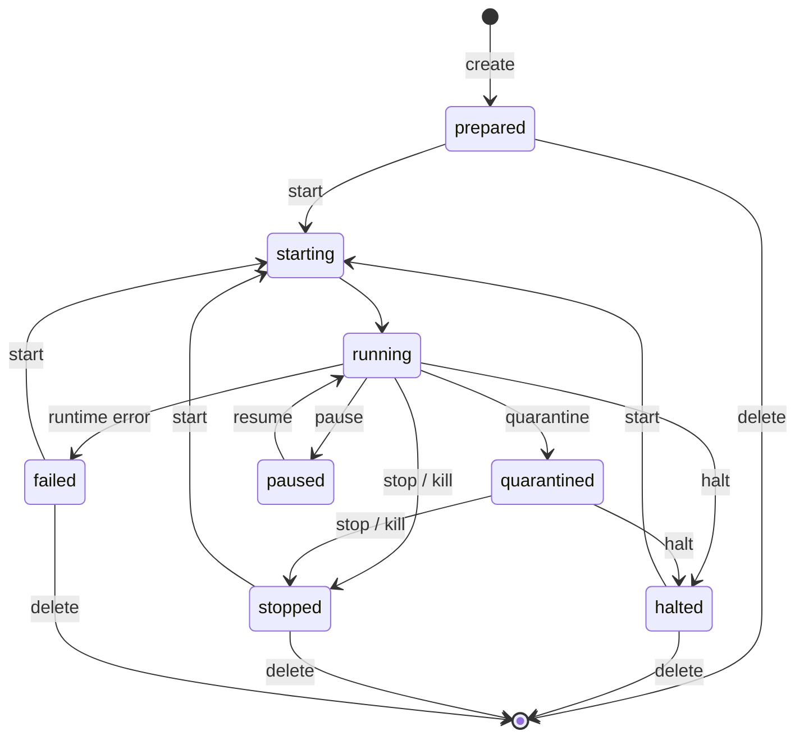

<!-- docs-last-updated -->
_Last updated: 2026-06-27_

Read this page to understand what microagent tells you about a workspace, and
when you can act on it. Every request carries an identity block; every
response carries a JSON event describing the resulting state; `status` adds
[readiness signals](#readiness) so callers can sequence work without polling
files or serial logs. [Keep a persistent workspace](/guides/persistent-workspaces/)
walks the lifecycle these states describe from the operator's seat.

## Identity

Every request has an identity:

```json
{
  "identity": {
    "requestID": "req-1",
    "runtimeID": "agent-1",
    "role": "workload",
    "backend": "apple-vf"
  }
}
```

- **`requestID`** - unique for this call. Echoed in the event so callers can
  correlate.
- **`runtimeID`** - the workspace identifier. Equivalent to `--name` /
  `--id`.
- **`role`** - caller-supplied label. Defaults to `workload`. microagent
  records it in requests, state files, and events but does not interpret it -
  use it however your runtime's identity model needs.
- **`backend`** - the backend the supervisor should target.

The CLI builds the identity automatically on the high-level `run` and
`create` paths - workspaces default to `role: workload` and the runtime ID
comes from `--name` / `--id`. The lower-level `create --rootfs` path and
`--json` requests let callers set `role` explicitly; see
[`microagent create`](/cli/create/) for the flags.

## State directory

State lives under `--state-dir`, default `~/.microagent/`. Each workspace
gets its own subdirectory containing:

- the rootfs disk and any built bundles
- a JSON state file with the latest event
- a durable JSON event timeline
- host runtime scratch used to track the live VM process

`microagent list` reads this directory. `microagent delete` removes a
workspace's subdirectory.

## Runtime verification

Named workspaces persist a verification record in their manifest when the
rootfs is built or copied from the local image store. The record includes:

- OCI image reference, resolved reference, and digest when available
- kernel path and SHA-256
- rootfs path and SHA-256
- injected guest init path and SHA-256

`microagent --json status <name>` recomputes the current file hashes and
compares enforced artifacts with the recorded values. Kernel and injected-init
hashes are enforced on every status check. Rootfs hashes are enforced while the
workspace is still `prepared`; once the workspace starts, the rootfs is the
writable VM disk, so status reports current and recorded rootfs hashes without
treating normal guest writes as drift. Enforced mismatches are reported under
`verification.divergence`; callers do not need to scrape logs or reimplement
hash checks for immutable runtime artifacts.

## Readiness

Status responses include readiness signals - this is what
[`microagent status`](/cli/status/) reports under `readiness` - so callers can
sequence work without polling files or serial logs:

- **`guestReady`** - the backend has concrete evidence that the guest reached
  a started runtime state. Backends do not have to treat a hypervisor process
  state as guest readiness.
- **`shellReady`** - console input is available and the configured shell has
  reached the backend's readiness gate.
- **`execReady`** - the structured exec service is reachable and a no-op exec
  request completes end-to-end.
- **`resultReady`** - the guest result file exists.
- **`mediationReady`** - a declared mediation channel target is live reachable
  for a running workspace. Optional mediation reports `ready: false` without a
  hard `error` when the target is unavailable; required mediation reports an
  error.

Each signal carries `ready`, optional `observedAt`, and optional detail/error
fields.

## Events

Lifecycle responses include an event:

```json
{
  "ok": true,
  "backend": "apple-vf",
  "event": {
    "identity": { "...": "..." },
    "state": "prepared",
    "observedAt": "2026-05-02T00:00:00Z"
  }
}
```

States cover the lifecycle: `unknown`, `prepared`, `starting`, `running`,
`paused`, `stopping`, `halted`, `quarantined`, `stopped`, and `failed`.
`halted` means the workspace was cleanly stopped with disk state and identity
preserved for a later `start`. `quarantined` means host-side network,
mediation, and side effect paths were severed while preserving disk state and
event history. `start` is disk-state resume from `prepared`, `halted`,
`stopped`, or `failed`; `quarantined` must be explicitly halted, stopped, or
killed before it can be started again.

`paused` is memory state, not disk state: `pause` freezes a running
workspace's vCPUs while preserving memory and disk, and `resume` thaws it back
to `running` exactly where it left off. `exec`, `connect`, and `stats` are
rejected while paused. This is distinct from `halt`, which discards memory and
reboots from disk on the next `start`.
Commands such as `kill` and `delete` still return lifecycle events, usually
with state `stopped` and a `detail` field. Callers should treat these strings as
the authoritative source of truth, not log scraping.



Two non-obvious things to read from that diagram:

- **Nothing goes directly from `quarantined` back to `start`.** Quarantine is a forensic state - you have to halt, stop, or kill it first, then start from the resulting clean state.
- **`running` has no direct path to `delete`.** Take the workspace through
  halt, stop, or kill first.

`unknown` and `stopping` are real states the API can report - `unknown` for unrecognized state files, `stopping` as the transient between `running` and a terminal state - but neither sits between user-driven transitions, so they're omitted above.

Each state write updates `<state-dir>/<runtimeID>/event.json` with the latest
event and appends the same record to `<state-dir>/<runtimeID>/events.json`.
Lifecycle events that do not change workspace state can also append to
`events.json` without replacing `event.json`; for example, model-paired
workspaces record `model_worker=attached` and `model_worker=released` markers
when a host model runner is attached or released. The timeline survives VM
runtime exit and is intentionally small: it is a forensic lifecycle and
host-side event record, not a log stream.
