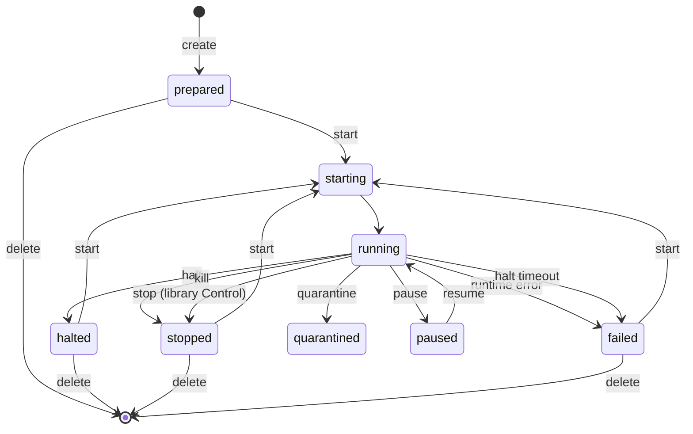

<!-- docs-last-updated -->
_Last updated: 2026-09-06_

Read this page to understand what microagent tells you about a workspace, and
when you can act on it. Every request carries an identity block; every
response carries a JSON event describing the resulting state; `status` adds
[readiness signals](#readiness) so callers can sequence work without polling
files or serial logs. [Keep a persistent workspace](../guides/persistent-workspaces.md)
walks the lifecycle these states describe from the operator's seat.

## Identity

Every request has an identity:

```json
{
  "identity": {
    "requestID": "req-1",
    "runtimeID": "agent-1",
    "sessionID": "session-brisk-otter-4f9c",
    "role": "workload",
    "backend": "apple-vf"
  }
}
```

- **`requestID`** - unique for this call. Echoed in the event so callers can
  correlate.
- **`runtimeID`** - the workspace identifier. Equivalent to `--name` /
  `--id`.
- **`sessionID`** - one concrete VM execution lifetime. Every start, resume,
  restore, and fork creates a new session.
- **`sourceSessionID`** - the prior execution when a session resumes or derives
  from existing state. It is absent for the first boot.
- **`role`** - caller-supplied label. Defaults to `workload`. microagent
  records it in requests, state files, and events but does not interpret it -
  use it however your runtime's identity model needs.
- **`backend`** - the backend the supervisor should target.

Callers may attach `purpose` and `correlationID` when they create, run, or
dispatch a workspace. microagent persists both values verbatim and promotes
them in the joined trajectory and quarantine incident receipt. They are
descriptive context only, never policy or authorization input.
Lifecycle mutation adapters expose the operation-specific purpose as
`--reason` in the CLI and `reason` in MCP. It is stored in the same identity
field, so events and quarantine receipts do not need an adapter-specific audit
shape. microagent does not infer an initiator from the operating-system user.
High-impact `kill` and `quarantine` operations require this reason; their CLI
and MCP adapters also require explicit confirmation. The reason remains
descriptive evidence, not proof of caller authority.

Lifecycle mutation events include a `lifecycle` audit block. `initiator`
identifies the adapter and preserves an MCP principal's `workload_identity`
and `delegated_authority`; its `assurance` is `caller_asserted`, because
microagent records but does not authenticate that principal. CLI and direct
library calls use `unavailable` assurance rather than inventing an identity
from the host user. `workInFlight.declared` comes from the host-owned manifest.
For a running workspace, clean halt and live delete may attempt a one-second,
64 KiB process listing; it is labeled `guestReported` and never presented as
host-verified evidence. Quarantine does not ask a potentially compromised guest
for evidence after accepting containment. Its memory-and-disk snapshot preserves
the frozen process state instead. Capture failure is recorded and cannot restore
authority; stop and custody remain pending while a retry preserves the same
volatile state. An explicit `--no-capture` retry accepts that evidence loss and
completes custody. Hard kill never waits for guest cooperation.
The block's `notification` record states `not_performed` and assigns ownership
to the caller, since microagent has no principal directory or notification
channel. A successful quarantine links its forensic snapshot through
`workInFlight.evidenceRef`.

The CLI builds the identity automatically on the high-level `run` and
`create` paths - workspaces default to `role: workload` and the runtime ID
comes from `--name` / `--id`. The lower-level `create --rootfs` path and
`--json` requests let callers set `role` explicitly; see
[`microagent create`](../cli/create.md) for the flags.

Audit records also carry an `event_id`. Egress, broker, and secret-access
records carry an `operation_id` for the concrete mediated action. A
`requestID` appears only when the record is directly caused by that host API
request; long-lived mediators do not reuse their startup request ID for later
guest activity.

## State directory

State lives under `--state-dir`, default `~/.microagent/`. Each workspace
gets its own subdirectory containing:

- the rootfs disk and any built bundles
- a JSON state file with the latest event
- a durable JSON event timeline
- host runtime scratch used to track the live VM process

`microagent list` reads this directory. `microagent delete` removes a
workspace's subdirectory.

### Linux Firecracker socket path budget

The Linux backend creates pathname Unix sockets below
`<state-dir>/<workspace>/`. Linux reserves 108 bytes for `sockaddr_un.sun_path`,
including its terminating NUL byte. The longest path microagent may generate is
`<state-dir>/<workspace>/vsock.sock_4294967295`, so a configuration that leaves
room for every valid vsock port satisfies:

```text
UTF-8 bytes(<state-dir>) + bytes(<workspace>) <= 84
```

Workspace names contain only ASCII, so their character and byte counts match.
Count the normalized state-directory path in UTF-8 bytes; nested temporary
directories can consume the budget quickly. The 63-character workspace-name
limit is the syntax ceiling, while this combined path budget can impose a
shorter practical limit on Linux. Microagent does not yet reject an over-budget
combination at create time.

Prefer a short state directory such as `/var/tmp/microagent` when using long
workspace names. If startup fails with `listen unix ... bind: invalid argument`,
shorten `--state-dir` or the workspace name and retry.

## Runtime verification

Named workspaces persist a verification record in their manifest when the
rootfs is built or copied from the local image store. The record includes:

- OCI image reference, resolved reference, and digest when available
- kernel path and SHA-256
- rootfs path and SHA-256
- durable, content-addressed per-workspace copy of the injected guest init and
  its SHA-256
- per-boot config disk path and SHA-256 — the command, env, mounts,
  forwards, and declared files the guest will actually apply, re-recorded
  each time a start regenerates the disk

For a workspace copied from the image store, the manifest also records
`rootfs_base`: the SHA-256 and immutable posture of the sealed shared source.
Status exposes the same lineage as `rootfsBase`. This is separate from runtime
verification: the base remains read-only and is never attached to the guest,
while the workspace rootfs is its private writable derivation.

Immediately after that private disk is derived, microagent records the sealed
base SHA-256 as the disk's initial content identity instead of rereading the
entire clone. The copy must have completed, the size must match, and the guest
has not run yet. Later status checks still hash the private disk whenever it is
quiescent, so guest writes and unexpected changes remain detectable.

When `create --setup` succeeds, the setup-modified rootfs and final boot config
replace the pre-boot rootfs and one-shot setup-config measurements together.
The setup-complete marker is written in the same manifest revision. A failed
setup keeps the earlier record and remains eligible for retry.

`microagent --json status <name>` recomputes the current file hashes and
compares enforced artifacts with the recorded values. Kernel, injected-init,
and config-disk hashes are enforced on every status check. A new workspace
copies guest init into its own state directory before building the rootfs. The
artifact name includes its SHA-256, so package-manager upgrades cannot remove
or overwrite the recorded bytes. Older records whose installation path is gone
retain the recorded SHA-256 as the embedded content identity.

Rootfs hashes are enforced whenever the disk is quiescent: `prepared`,
`halted`, `stopped`, `quarantined`, or `failed`. While the workspace is
running, the rootfs is the writable VM disk, so status reports current and
recorded rootfs hashes without treating normal guest writes as drift.
Enforced mismatches are reported under `verification.divergence`; callers do
not need to scrape logs or reimplement hash checks for immutable runtime
artifacts.

## Readiness

Status responses include readiness signals - this is what
[`microagent status`](../cli/status.md) reports under `readiness` - so callers can
sequence work without polling files or serial logs:

- **`guestReady`** - the backend has concrete evidence that the guest reached
  a started runtime state. Backends do not have to treat a hypervisor process
  state as guest readiness.
- **`shellReady`** - console input is available and the configured shell has
  reached the backend's readiness gate.
- **`execReady`** - the structured exec service is reachable and a no-op exec
  request completes end-to-end.
- **`resultReady`** - the guest result file exists.
- **`mediationReady`** - a declared mediation channel target is live reachable
  for a running workspace. Optional mediation reports `ready: false` without a
  hard `error` when the target is unavailable; required mediation reports an
  error.

Each signal carries `ready`, optional `observedAt`, and optional detail/error
fields.

The `egressCapture` block reports both the configured capture contract and,
where the backend exposes an independently observable mediator, its current
`live` state. An omitted `live` field means liveness was not observed; declared
`coverageStatus` must not be treated as proof that enforcement is running. A
dead observed mediator is recorded in the durable lifecycle event history.
The block also reports `encryptedDNS` separately: `broker` captures the TLS
transport but cannot identify DNS-over-HTTPS inside it, while `mitm` detects
and denies HTTP requests identified by the `/dns-query` path or
`application/dns-message` media type.
The `coverage.quic` field reports whether QUIC Initial packets are mediated,
dropped, unavailable, or outside the selected network mode.

Broker assurance is durable workspace state, not an adapter hint. The
manifest carries each endpoint's `assurance` and typed semantic `grant`.
Broker decisions report typed `assurance`, `operation`, and `effect` fields.
An authorized redirect chain also reports its hop count and final host,
operation, and effect.
CLI, AX, MCP, Linux KVM, and Apple VF consume that same library-owned
configuration.

## Events

Lifecycle responses include an event:

```json
{
  "ok": true,
  "backend": "apple-vf",
  "event": {
    "identity": { "...": "..." },
    "state": "prepared",
    "observedAt": "2026-05-02T00:00:00Z"
  }
}
```

States cover the lifecycle: `unknown`, `prepared`, `starting`, `running`,
`paused`, `stopping`, `halted`, `quarantined`, `stopped`, and `failed`.
`halted` means the workspace was cleanly shut down with disk state and
identity preserved for a later `start`. `halt` is the canonical
graceful-shutdown verb; in the CLI, `stop` is a registry-level alias of
`halt` and produces the identical `halted` outcome on a clean exit. Calling
the library's `Control("stop")` command directly is a separate code path
that runs the same graceful shutdown but records `stopped`, not `halted` -
see [the Go library reference](../library/go.md#workspace-api) for that
distinction. Both paths send a narrow shutdown request over the structured
exec control channel. Guest PID 1 forwards the persisted OCI `StopSignal` to
the workload process group, waits for it to exit, and powers off. If the guest
rejects the request or does not exit within the host window, the operation
fails closed; it never silently becomes a hard kill. `quarantined` means the
library durably marked containment, froze execution, severed host authority,
attempted forensic capture while frozen, and stopped the runtime into custody.
`start` is disk-state resume from `prepared`, `halted`, `stopped`, or `failed`;
a durable containment marker denies start and resume regardless of a later
state-file rewrite.

`paused` is memory state, not disk state: `pause` freezes a running
workspace's vCPUs while preserving memory and disk, and `resume` thaws it back
to `running` exactly where it left off. `exec`, `connect`, and `stats` are
rejected while paused. This is distinct from `halt`, which discards memory and
reboots from disk on the next `start`.

## What survives each operation

State has four lifetime boundaries:

- **Runtime:** memory, processes, and live connections.
- **Workspace:** rootfs, identity, events, results, and artifact declarations.
- **Snapshot:** captured memory, device state, and rootfs.
- **Independent:** named volumes, which have their own lifecycle.

The practical guarantees are:

| Operation | Runtime state | Workspace state | Snapshots | Named volumes |
|---|---|---|---|---|
| `pause`, `resume` | Memory and processes preserved; live connections are not guaranteed | Preserved | Preserved | Preserved |
| `halt`, `stop` | Discarded | Preserved after a bounded guest filesystem flush attempt | Preserved | Preserved |
| `kill` | Discarded | Preserved only as already flushed | Preserved | Preserved |
| `quarantine` | Frozen before authority severance; preserved frozen on capture failure, otherwise discarded after capture or explicit skip | Disk, identity, events, phase result, and other host records held in custody | Preserved; the custody capture cannot be deleted through ordinary snapshot deletion | Preserved |
| Snapshot create | Captured; source resumes | Preserved; rootfs is also captured | New capture retained with the workspace | Preserved, but not captured |
| Snapshot restore | Memory, processes, and rootfs restored; connections reset | Identity and host event history preserved | Preserved | Preserved, but not rolled back |
| Snapshot fork | Memory, processes, and rootfs copied; connections reset | Fresh identity, events, and results | Selected snapshot copied into the fork | Not copied from the snapshot |
| `delete` | Removed | Removed | Removed with the workspace | Detached and preserved |

`microagent contract` exposes the same matrix as typed JSON under
`durability`. Integrations should use that data instead of inferring retention
from lifecycle state names.

Storage guarantees are a separate concern. The contract exposes them under
`persistence`, with every microagent-owned file family assigned to one tier:

| Tier | What belongs there | Failure and cleanup behavior |
|---|---|---|
| `recoverable` | Derived caches, serial logs, and transient host bookkeeping | May be pruned or recreated; never authoritative for workspace state |
| `operational` | Workspace manifests and disks, runtime state, ordinary snapshots, volumes, and registry configuration | Structured metadata is replaced atomically and malformed state fails closed; retained until its owning resource is explicitly deleted |
| `audit` | Lifecycle events and egress, broker, and secret-access records | Ordered records with explicit bounds; malformed or interrupted records are reported instead of silently omitted |
| `evidence` | Containment markers/results and forensic snapshots that may retain guest secrets | Markers fence execution even if their result is damaged; captures publish only as complete directories and are never restored. Ordinary deletion refuses the active custody record and its capture |

State directories and files are private to the operator by default (`0700`
directories and `0600` structured state). `microagent contract` identifies
each artifact family's writer, cleanup owner, retention, recovery behavior,
and whether it can contain secrets. Cache pruning and stale-runtime cleanup
must not remove operational state, audit streams, named volumes, or forensic
evidence.

Commands such as `kill` and `delete` still return lifecycle events, usually
with state `stopped` and a `detail` field. Callers should treat these strings as
the authoritative source of truth, not log scraping.



`stop` here is the library's `Control("stop")` command; the CLI's `stop` is
an alias of `halt` and lands on `halted` instead, per the CLI/library split
above.

Two non-obvious things to read from that diagram:

- **Nothing leaves `quarantined` through the ordinary lifecycle.** The durable
  marker blocks start, resume, restore, mutation, workspace deletion, and
  deletion of the custody snapshot. Recovery never means deleting the marker
  to make execution possible.
- **`running` has no direct path to `delete`.** Take the workspace through
  halt, stop, or kill first.

`unknown` and `stopping` are real states the API can report - `unknown` for unrecognized state files, `stopping` as the transient between `running` and a terminal state. But neither sits between user-driven transitions, so they're omitted above.

Use [`microagent wait`](../cli/wait.md), the `--wait` flag on
[`start`](../cli/start.md), or the MCP `workspace.wait` tool to block until a
workspace reaches a terminal state (`stopped`, `halted`, `failed`,
`quarantined`, or a never-started `prepared`). Don't poll `status` in a loop.
All three share `workspace.Wait` and report the terminal state with an `ok`
verdict.

Each state write updates `<state-dir>/<runtimeID>/event.json` with the latest
event and appends the same record to `<state-dir>/<runtimeID>/events.json`.
Lifecycle events that do not change workspace state can also append to
`events.json` without replacing `event.json`; for example, model-paired
workspaces record `model_worker=attached` and `model_worker=released` markers
when a host model runner is attached or released. CLI, MCP, and Go callers using
`modelservice.Pair` share these model lifecycle events. Writers are serialized across
microagent processes; array order is commit order, duplicate observations are
retained, and the most recent 1,024 records are kept. Each rewrite is atomic,
and malformed history is reported instead of silently replaced. The timeline
survives VM runtime exit and is intentionally small: it is a forensic lifecycle
and host-side event record, not a log stream.

For consequential lifecycle mutations, the terminal record names the caller
context, reason, work in flight, notification disposition, time, and outcome in
one event. `observedAt` is the time and `state` is the outcome.

Every successful manifest, config-disk, and boot-verification write also adds a
revision to `workspaces/<workspace>/constraint-history.json`. Each revision
contains the complete persisted manifest, artifact hashes, trigger, timestamp,
runtime identity, request identity, purpose, and correlation key. A complete
manifest is stored instead of a diff, so retained revisions remain independently
reconstructable after older entries expire.

The history uses the same locked, atomic, fail-closed storage as lifecycle
events and retains the latest 1,024 revisions. `status` reports its path, count,
limit, and oldest and latest revision references in `constraintHistory`.
`workspace.ReadConstraintHistory` returns the complete typed records.

`workspace.ReadTrajectory` joins lifecycle, constraint, egress, broker, and
secret-access records into one chronological view using parsed RFC 3339 timestamps. The
structured `microagent events` and MCP `workspace.events` responses use this
joined view; text `events` and `events --follow` remain the concise lifecycle
timeline.
